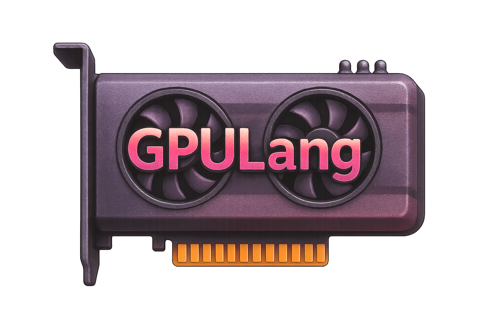

GPULang
=====

GPULang is a frontend shader language and compiler, designed to serve as a common shader interface for multiple backends and platforms.

**GPULang is not based on nor is dependent on LLVM**

GPULang targets backend platforms directly, by aiming to translate its relatively low level custom frontend language to SPIR-V, WGSL and Metal. GPULang is designed from the bottom up to support certain quality of life features such as enums, type aliases, and fp16 (work in progress), as well as exposing certain low level functionality on a native level, such as device addresses (through pointers) as well as shader stage link validation and shader pipeline composition with depth/rasterization/blend states and shader stages combined and validated at compile time.

GPULang also offers a reflection API, which allows an application to reason about the shader resource layout, allowing for a dynamic setup of desciptor sets/root signatures/bind groups/etc...

GPULang uses the following libraries (which are either copied or downloaded through fips):

* [[spv-tools]](https://github.com/KhronosGroup/SPIRV-Tools)
* [[argh]](https://github.com/adishavit/argh)
* [[lsp-framework]](https://github.com/leon-bckl/lsp-framework)

### Webpage
[[GPULang]](https://gscept.github.io/GPULang/)
